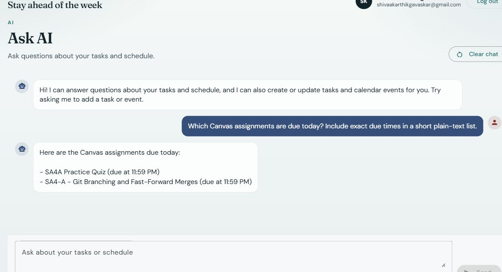
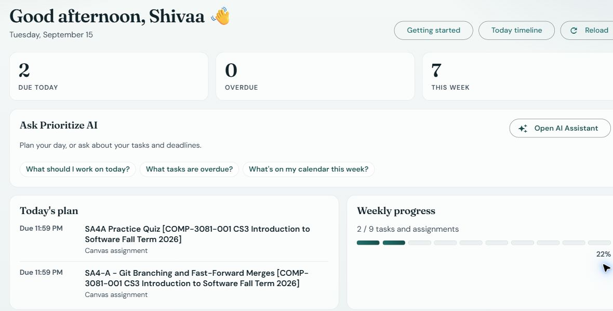
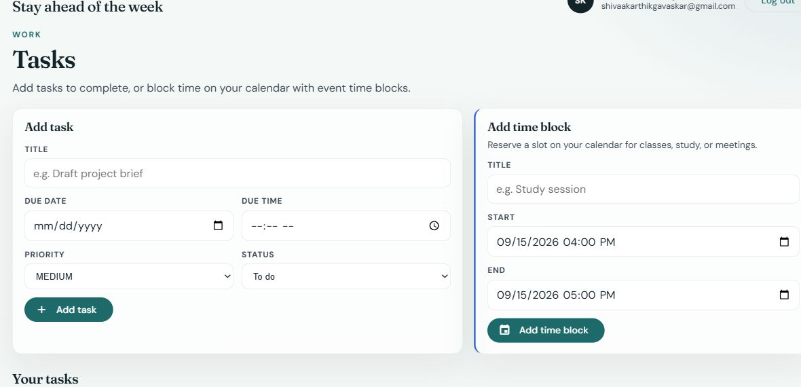
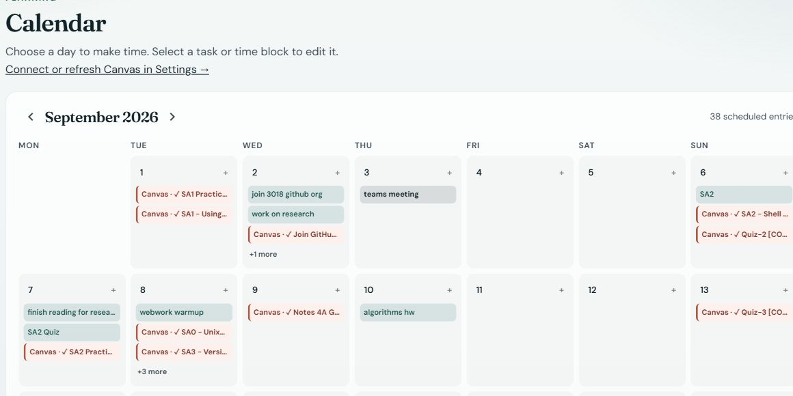
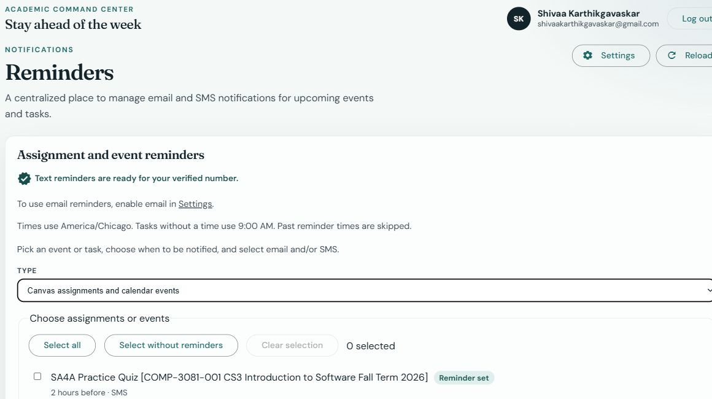
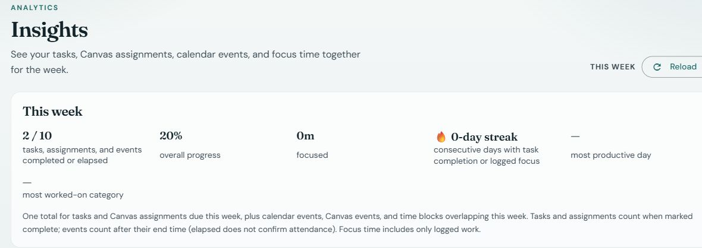
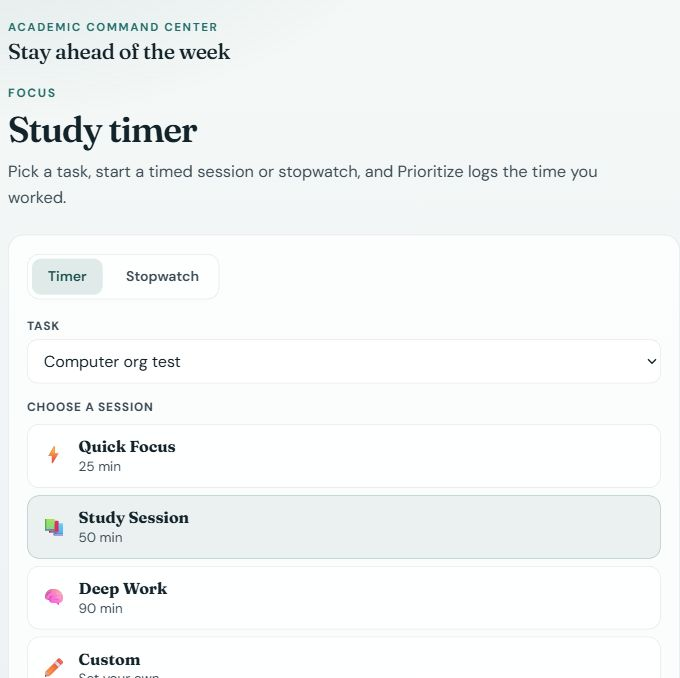
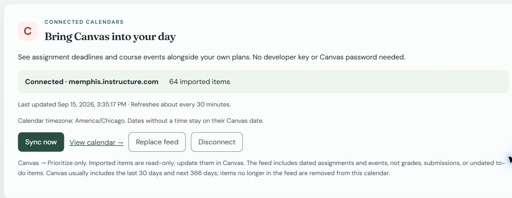

# Prioritize

AI-powered productivity and academic planning platform with Canvas Calendar Feed integration. Organize work as Goals → Projects → Tasks, block time on a schedule, manage calendar events and routines, and track progress with reminders, insights, and time entries.

## Screenshots

**Live app:** [theprioritize.com](https://theprioritize.com/) · **Default branch:** [main](https://github.com/shivaak67/prioritize/tree/main)

Captured from the deployed application on September 15, 2026. These are live app screens; account contact information and private Canvas feed URLs are excluded.

### Ask AI — plan with your actual tasks and Canvas deadlines

Ask natural-language questions about your workload, deadlines, and schedule. The OpenAI-powered assistant uses your task and calendar context, including imported Canvas assignments, and can create or update tasks and events. Below, it retrieves today's Canvas assignments and their exact due times.



### Dashboard — see what needs attention

Due Today, Overdue, This Week, and weekly assignment progress combine personal tasks and Canvas assignments. Today's plan shows upcoming deadlines with direct access to the AI assistant.



### Tasks and Canvas assignments

Search and filter your work, edit personal tasks, and mark Canvas assignments complete or reopen them. Canvas completion is tracked in Prioritize only; it does not submit work or change Canvas. Date-only deadlines say when Canvas has not provided a time; you can enter an exact local deadline in Calendar.



### Calendar — your deadlines and plans together

See personal tasks, editable time blocks, Canvas assignments, and course events in one calendar.



### Reminders — see what is already scheduled

Existing reminders are marked beside each assignment or event, including timing and channel. Select several items, select all, or select only items without reminders. Recent activity can be cleared separately from pending reminders.



### Insights — one weekly total

Tasks, Canvas assignments, calendar events, and time blocks contribute to the same weekly progress total. Tasks and assignments count when marked complete; events count once their end time has elapsed. Logged focus time remains a measure of recorded work.



### Focus — turn plans into study time

Choose a task and a study duration, then start a timer or use the stopwatch to log focused work.



### Canvas connection — no developer key required

Settings guides users through Canvas → Calendar → Calendar Feed. The read-only connection imports deadlines and events and refreshes automatically. The connected account below has 64 imported items.



## Overview

Prioritize helps you plan and execute work with a clear hierarchy: categories and goals break into projects and tasks. You set manual priorities and schedule blocks yourself. Canvas Calendar Feed integration imports assignment deadlines and events into your calendar; it does not use the Canvas API or sync grades or submissions. There is no Google Calendar sync or automatic priority engine. The app also covers routines, reminders, notifications, time tracking, and insights. Power BI can connect separately for historical analytics.

## Features

- Email/password and Google OAuth authentication (JWT)
- Direct entry to dashboard or sign-in, with account creation and Google sign-in
- Guided first session: task → calendar time block → Focus
- Calendar creation and editing with date validation and failed-save recovery
- Canvas Calendar Feed connection: read-only deadlines/events, automatic refresh, and manual sync
- Categories, goals, projects, and tasks (manual priority)
- Schedule blocks (time-blocking) and personal calendar events
- Recurring routines and occurrences
- Reminders and in-app notifications
- Time entries and insights summary: weekly progress combines tasks, Canvas assignments, calendar events, and time blocks. Tasks and assignments count when marked complete; events count after their end time has elapsed. Scheduled time does not count as logged focus. Week boundaries follow the browser's time zone.
- OpenAI-powered assistant for task and calendar questions, creation, and updates
- Dashboard overview
- Power BI–ready PostgreSQL schema

*(Sections expand as each development phase lands.)*

## Architecture

Monorepo with a Spring Boot API, Angular SPA, and PostgreSQL.

- Backend enforces ownership and authorization on every resource
- Frontend consumes REST APIs via Angular services
- Planning model: Category / Goal / Project / Task plus schedule, calendar, routines, reminders, time tracking
- Analytics (Power BI) reads the database; it is not the main UI

See [docs/architecture.md](docs/architecture.md) for schema, auth flow, and phase plan.

## Tech Stack

| Layer | Technologies |
|-------|----------------|
| Frontend | Angular, TypeScript, Angular Material |
| Backend | Java, Spring Boot, Spring Security, Spring Data JPA |
| Database | PostgreSQL |
| Auth | JWT + Google OAuth 2.0 / OIDC |
| Analytics | Power BI |
| DevOps | Docker, Docker Compose, GitHub Actions |
| Cloud | AWS EC2 + EBS; PostgreSQL runs in Docker on EC2 |

## Project Structure

```
├── backend/          # Spring Boot API
├── frontend/         # Angular SPA
├── docs/             # Architecture, API contracts, agent workflow
├── infra/            # AWS / deployment notes (later)
├── .github/          # CI/CD workflows (later)
├── .env.example      # Environment variable template
└── docker-compose.yml  # Local full stack (Postgres + API + SPA)
```

## Getting Started

### Prerequisites

- JDK 21+
- Node.js 20+ and npm
- PostgreSQL 16+ (or Docker)
- Google Cloud OAuth client (for Google sign-in)

### Setup

1. Clone the repository
2. Copy `.env.example` to `.env` and fill in values
3. Start PostgreSQL and create the `prioritize` database
4. Backend:
   - Requires JDK 21+
   - From `backend/`: `./mvnw spring-boot:run` (Windows: `mvnw.cmd spring-boot:run`)
   - Health check: `GET http://localhost:8080/actuator/health`
   - Tests: `./mvnw test`
5. Frontend:
   - Requires Node.js 20+ and npm
   - From `frontend/`: `npm install` then `npm start` → http://localhost:4200
   - API base URL: `http://localhost:8080` (see `src/environments/`)
   - Production build: `npm run build`

Planning APIs (goals, projects, tasks, etc.) require `Authorization: Bearer <JWT>` from `/api/auth/login` or `/api/auth/register`. Cross-user access returns `404`.

## Authentication

- **Local:** register / login with email and password (BCrypt hashes)
- **Google:** “Continue with Google” via Spring Security OAuth2 Login; app issues the same JWT

### Google OAuth setup (local)

1. In [Google Cloud Console](https://console.cloud.google.com/), create an OAuth 2.0 Client ID (Web application)
2. Add authorized redirect URI: `http://localhost:8080/login/oauth2/code/google`
3. Copy client ID/secret into `.env`:
   - `GOOGLE_OAUTH_ENABLED=true`
   - `GOOGLE_CLIENT_ID=...`
   - `GOOGLE_CLIENT_SECRET=...`
   - `APP_OAUTH_SUCCESS_REDIRECT=http://localhost:4200/auth/callback`
4. Restart the backend, then use **Continue with Google** on the login/register pages

Secrets: `GOOGLE_CLIENT_ID`, `GOOGLE_CLIENT_SECRET`, `JWT_SECRET` — never commit real values.

## Planning model

Work is organized as **Goals → Projects → Tasks**, with optional categories. Priority on tasks is set manually (`LOW` / `MEDIUM` / `HIGH` / `URGENT`). Schedule blocks attach tasks to calendar time; routines, reminders, time entries, and insights support day-to-day planning—not an automated ranking engine.

## API Overview

REST under `/api/*`. Auth: `/api/auth/*` and Google OAuth endpoints. See [docs/api-contract.md](docs/api-contract.md).

## Testing

- Backend: JUnit, Mockito, Spring Boot integration tests
- Frontend: Angular unit tests (added with the app scaffold)
- Ownership rules and planning CRUD are high-priority test targets

## Docker

Run the full local stack (PostgreSQL, Spring Boot API, Angular SPA via nginx) with Docker Compose.

1. Copy `.env.example` to `.env` and fill in secrets (`JWT_SECRET`, optional Google OAuth values).
2. From the repo root:

```bash
docker compose up --build
```

3. Open the app at [http://localhost:4200](http://localhost:4200). API: [http://localhost:8080](http://localhost:8080) (health: `/actuator/health`).

**How ports map**

| Service  | Host port | Notes |
|----------|-----------|--------|
| frontend | 4200 → 80 | nginx serves the SPA with client-side routing fallback (`FRONTEND_PUBLISHED_PORT`) |
| backend  | 8080 → 8080 | Browser calls `http://localhost:8080` for API and OAuth (matches Angular `apiBaseUrl`) |
| db       | 5433 → 5432 | Default host mapping avoids clashing with a local Postgres on 5432 (`POSTGRES_PUBLISHED_PORT`) |

Compose waits for Postgres and the API health check before starting the frontend.

**Google OAuth:** keep the authorized redirect URI as `http://localhost:8080/login/oauth2/code/google` (same as non-Docker local). Success redirect stays `http://localhost:4200/auth/callback`.

**Running backend on the host against Compose Postgres:** point `POSTGRES_HOST=localhost` and `POSTGRES_PORT=5433` in `.env` (or whatever you set for `POSTGRES_PUBLISHED_PORT`).

Stop with `Ctrl+C` or `docker compose down`. Add `-v` to also remove the database volume.

## CI/CD

GitHub Actions runs backend tests and the frontend production build on pull requests and pushes to `main` and `develop`. A separate job builds both Docker images to catch Dockerfile regressions. Pushes to `develop` that change application files also publish versioned images to GitHub Container Registry. Deployment selects a versioned image on the existing EC2 host.

Frontend behavior tests run with `npm test -- --watch=false --browsers=ChromeHeadless` from `frontend/`. Frontend tests cover assignment labels, time-block editing, bulk reminder selection, and clearing history. Backend tests cover feed parsing, dates, encryption, URL restrictions, bounded downloads, duplicate prevention, failure preservation, and account isolation.

## Connect Canvas

In Canvas, open **Calendar → Calendar Feed** and copy your private iCal link. In Prioritize, open **Settings → Bring Canvas into your day**, paste it, confirm the timezone, and select **Connect Canvas**. No developer key or Canvas password is needed. Currently supports HTTPS calendar-feed links on `*.instructure.com`.

Assignment deadlines and events appear as labeled, read-only calendar entries. Select an entry to view details or open Canvas. Imported deadlines keep their Canvas title and due date, but you can mark them Complete or Reopen them in Prioritize. This local status survives feed refreshes; it does not submit work or synchronize completion back to Canvas. Disconnecting or removing an item from the feed removes its local completion record. Refreshes run about every 30 minutes on a separate scheduler; **Sync now** is available with a one-minute cooldown. Canvas normally provides the previous 30 days and next 366 days and omits undated to-do items. See [Canvas's feed guide](https://community.instructure.com/en/kb/articles/662804-unknown).

Each successful refresh upserts by the Canvas item UID and removes imported copies no longer present in the feed. Failed or malformed downloads keep the previous successful snapshot. Disconnect removes the connection and its imported copies, leaving personal records intact. Canvas exports repeated occurrences individually; feeds containing recurrence rules are rejected rather than partially imported.

Feed URLs are encrypted with AES-GCM and never returned by the API. By default the encryption key is derived with a Canvas-specific label from the existing JWT secret; operators may set a stable `CANVAS_FEED_KEY` environment variable instead. Changing that key requires reconnecting feeds. Keep links, keys, database dumps, and feed contents out of source control. Downloads require HTTPS Canvas hosts, prohibit redirects/private addresses, have a 20-second total wait limit, and are capped at 2 MiB. V10 adds the connection table and import metadata without changing existing personal records.

## Deployment (AWS)

- Host: one AWS EC2 instance running Docker Compose
- Frontend: Angular build served by nginx, with API/OAuth requests proxied to Spring Boot
- Backend: Spring Boot container on the same EC2 host
- Database: PostgreSQL 16 container with data on a mounted EBS volume
- Releases: GitHub Actions → GHCR versioned images → EC2 deployment through AWS Systems Manager
- Configuration: environment variables supplied on the server

This is the live topology verified on September 9, 2026. EBS persistence is separate from backups; the single host remains a shared failure point. See `docker-compose.prod.yml` and `infra/` for deployment configuration.

## Analytics (Power BI)

Power BI connects to PostgreSQL for completion rates, workload trends, and estimated vs actual time. Angular remains the interactive app UI.

### Assignment and reminder controls

The Tasks page separates Canvas assignments and Canvas events from personal time blocks. Assignment cards show a due date or due time, and personal time blocks support inline editing of title, start, end, and all-day status.

In Reminders, select individual items or use **Select all** to apply reminder times to multiple items. Partial failures remain selected for retry. **Clear history** hides sent, failed, and cancelled activity for your account while preserving pending/processing reminders and internal delivery records.

Users without a Canvas connection see a dashboard setup card with three simple steps and a direct link to Settings.
